# Org Social Host

## Introduction

Org Social Host is a hosting service that allows you to host your `social.org` files online. It automatically provides you with a nickname and a system to update or share your file with other users.

```mermaid
graph LR
    User["👤 User"] -->|1. Signup| Host["🖥️ Org Social Host"]
    Host -->|2. Get vfile & public URL| User
    User -->|3. Upload social.org| Host
    Host -->|4. Serve publicly| Public["🌐 Public URL"]
    Followers["👥 Followers"] -->|Read| Public

    style Host fill:#667eea,stroke:#764ba2,stroke-width:3px,color:#fff,font-weight:bold
    style User fill:#f093fb,stroke:#f5576c,stroke-width:2px,color:#fff
    style Public fill:#4facfe,stroke:#00f2fe,stroke-width:2px,color:#fff
    style Followers fill:#43e97b,stroke:#38f9d7,stroke-width:2px,color:#fff
```



It is useful for:

- Taking your first steps in the [Org Social](https://github.com/tanrax/org-social) community
- Hosting your public file online without your own server
- Synchronizing multiple devices or clients with the same `social.org`
- Learning how Org Social works before self-hosting

## Very Important Notice

⚠️ **If you don't update your `social.org` at least once a month, you will lose the domain and the nickname will be released.**

This is a free service with automatic cleanup to ensure fair resource usage.

## Installation

You need to have Docker and Docker Compose installed.

### 1. Create a `.env` file based on `.env.example`

```bash
cp .env.example .env
```

### 2. Edit variables as needed

```bash
nano .env
```

#### Important Environment Variables

- **`NGINX_PORT`**: The port where the service will be available (default: `8080`)
  - Example: `NGINX_PORT=8080` → Service available at `http://localhost:8080`
  - Example: `NGINX_PORT=3000` → Service available at `http://localhost:3000`
  - Production: `NGINX_PORT=80` → Service available at `http://yourdomain.com`
- **`SECRET_KEY`**: Django secret key (⚠️ **MUST** change in production!)
- **`DEBUG`**: Set to `false` in production
- **`ALLOWED_HOSTS`**: Comma-separated list of allowed hostnames
- **`SITE_DOMAIN`**: Your domain (e.g., `host.org-social.org` or `localhost:8080`)
  - **Important**: Must match the port if not using standard ports (80/443)
- **`MAX_FILE_SIZE`**: Maximum file size in bytes (default: 5MB = 5242880)
- **`FILE_TTL_DAYS`**: Days before inactive files are deleted (default: 30)
- **`STORAGE_PATH`**: Path to store social.org files (default: `/app/storage`)

### 3. Run with Docker Compose

```bash
docker compose up -d
```

## Updating

To update your Org Social Host to the latest version:

```bash
# Navigate to your installation directory
cd /path/to/org-social-host

# Pull the latest changes
git pull

# Rebuild and restart services
docker compose up -d --build

# Apply database migrations (if any)
docker compose exec django python manage.py migrate
```

## Usage

### Quickstart (Registration and client configuration)

#### Option 1: Web Interface

Go to `http://localhost:8080/signup` (or your configured domain) and choose a nickname.

#### Option 2: Terminal (curl)

```sh
curl -X POST http://localhost:8080/signup \
  -H "Content-Type: application/json" \
  -d '{"nick": "my-nick"}'
```

Replace `my-nick` with your desired nickname.

**Response:**

```json
{
  "type": "Success",
  "errors": [],
  "data": {
    "vfile": "http://localhost:8080/vfile?token=abc123&ts=1700000000&sig=xyz789",
    "public-url": "http://localhost:8080/my-nick/social.org"
  }
}
```

If the nickname is available, you will receive 2 elements that you must keep very safe:

- **`vfile`**: A path that represents your `social.org` file in a unique and virtual way. **You should not share it with anyone.** The format is usually like this: `http://localhost:8080/vfile?token=123456789&ts=1700000000&sig=abc123`.
- **`public-url`**: The public URL where your `social.org` file will be hosted. You can share this URL with anyone you want. The format is usually like this: `http://localhost:8080/my-nick/social.org`.

#### Configure org-social.el client

If you use the `org-social.el` client, configure it as follows:

```elisp
(setq org-social-file "YOUR_VFILE_HERE")  ;; Your vfile here
(setq org-social-my-public-url "YOUR_PUBLIC_URL_HERE")  ;; Your public-url here
(setq org-social-relay "https://relay.org-social.org/")  ;; Relay server
```

Next, edit your `social.org` file with `M-x org-social-open-file` and save it with `C-x C-s` to upload it to the server.

Once you have included some followers, you can open the timeline with `M-x org-social-timeline`.

### Update your `social.org` file

The client will take care of updating your `social.org` file on the server every time you save it.

If you want to do it manually, you can use the following command:

```sh
curl -X POST http://localhost:8080/upload \
    -F "vfile=YOUR_VFILE_HERE" \
    -F "file=@/path/to/your/social.org"
```

**Note:** The `vfile` parameter should be the full vfile URL you received during signup.

### Delete your `social.org` file

If you wish to delete your `social.org` file from the server, you can do so with the following command:

```sh
curl -X POST http://localhost:8080/delete \
    -H "Content-Type: application/json" \
    -d '{"vfile": "YOUR_VFILE_HERE"}'
```

⚠️ **This is a non-reversible action!**

Alternatively, wait for 1 month (or configured TTL) without updating it, in which case it will be automatically deleted.

### Custom redirection

You may want to move your file from this host to another domain, hosting, or server; but you don't want to lose your followers (who are pointing to your host domain). In that case, you have a custom redirection feature for migration that is permanent (HTTP 301).

To do this, use the following command:

```sh
curl -X POST http://localhost:8080/redirect \
    -H "Content-Type: application/json" \
    -d '{"vfile": "YOUR_VFILE_HERE", "new-url": "https://my-new-domain.org/social.org"}'
```

**What happens:**

- You will no longer be able to update your file on this host
- Your `public-url` will redirect (HTTP 301) to the new URL you specified
- Your followers won't notice the change (automatic redirect)
- You can do this action as many times as you want

Although your followers won't notice the change, we recommend notifying them of the migration so they can update their `social.org` with the new URL.

#### Remove redirection

To remove the redirection and return to the previous state where you could upload a file:

```sh
curl -X POST http://localhost:8080/remove-redirect \
    -H "Content-Type: application/json" \
    -d '{"vfile": "YOUR_VFILE_HERE"}'
```

This will:
- Remove the redirect
- Allow you to upload files again
- Resume normal hosting

## Endpoints for users

### Root

`/` - Basic information about the host service.

```sh
curl http://localhost:8080/
```

```json
{
  "type": "Success",
  "errors": [],
  "data": {
    "name": "Org Social Host",
    "description": "Host your social.org files online",
    "version": "1.0.0"
  },
  "_links": {
    "self": {"href": "/", "method": "GET"},
    "signup": {"href": "/signup", "method": "POST"},
    "upload": {"href": "/upload", "method": "POST"},
    "delete": {"href": "/delete", "method": "POST"},
    "redirect": {"href": "/redirect", "method": "POST"},
    "remove-redirect": {"href": "/remove-redirect", "method": "POST"},
    "public-routes": {"href": "/public-routes", "method": "GET"}
  }
}
```

### Public Routes

`/public-routes` - List all public social.org files hosted on the server.

This endpoint allows you to discover other users' public files and explore the Org Social community on this instance.

**Request:**

```sh
curl http://localhost:8080/public-routes
```

**Response:**

```json
{
  "type": "Success",
  "errors": [],
  "data": [
    "http://localhost:8080/alice/social.org",
    "http://localhost:8080/bob/social.org",
    "http://localhost:8080/charlie/social.org"
  ]
}
```

**Notes:**

- Only active files (not redirected) are included in the list
- Files without content are excluded
- This endpoint is useful for discovering users and building community directories

### Signup

`/signup` - Register a new nickname and get vfile token.

**Request:**

```sh
curl -X POST http://localhost:8080/signup \
  -H "Content-Type: application/json" \
  -d '{"nick": "alice"}'
```

**Response:**

```json
{
  "type": "Success",
  "errors": [],
  "data": {
    "vfile": "http://localhost:8080/vfile?token=abc123&ts=1700000000&sig=xyz789",
    "public-url": "http://localhost:8080/alice/social.org"
  }
}
```

**Errors:**

- Nickname already taken
- Invalid nickname format (only alphanumeric, hyphens, underscores)
- Nickname too short (minimum 3 characters) or too long (maximum 50 characters)

### Upload

`/upload` - Upload or update your social.org file.

**Request:**

```sh
curl -X POST http://localhost:8080/upload \
    -F "vfile=http://localhost:8080/vfile?token=abc123&ts=1700000000&sig=xyz789" \
    -F "file=@/path/to/your/social.org"
```

**Response:**

```json
{
  "type": "Success",
  "errors": [],
  "data": {
    "message": "File uploaded successfully",
    "public-url": "http://localhost:8080/alice/social.org"
  }
}
```

**Errors:**

- Invalid vfile token
- File too large (exceeds MAX_FILE_SIZE)
- Invalid file format (must be .org file)
- Account is currently redirected (cannot upload)

### Delete

`/delete` - Delete your hosted file.

**Request:**

```sh
curl -X POST http://localhost:8080/delete \
    -H "Content-Type: application/json" \
    -d '{"vfile": "YOUR_VFILE_HERE"}'
```

**Response:**

```json
{
  "type": "Success",
  "errors": [],
  "data": {
    "message": "File deleted successfully"
  }
}
```

**Errors:**

- Invalid vfile token
- File not found

### Redirect

`/redirect` - Set up permanent redirect to new URL.

**Request:**

```sh
curl -X POST http://localhost:8080/redirect \
    -H "Content-Type: application/json" \
    -d '{"vfile": "YOUR_VFILE_HERE", "new-url": "https://my-domain.org/social.org"}'
```

**Response:**

```json
{
  "type": "Success",
  "errors": [],
  "data": {
    "message": "Redirect configured successfully",
    "redirect-url": "https://my-domain.org/social.org"
  }
}
```

**Errors:**

- Invalid vfile token
- Invalid URL format
- File not found

### Remove Redirect

`/remove-redirect` - Remove redirect and resume hosting.

**Request:**

```sh
curl -X POST http://localhost:8080/remove-redirect \
    -H "Content-Type: application/json" \
    -d '{"vfile": "YOUR_VFILE_HERE"}'
```

**Response:**

```json
{
  "type": "Success",
  "errors": [],
  "data": {
    "message": "Redirect removed successfully"
  }
}
```

**Errors:**

- Invalid vfile token
- No redirect configured
- File not found

### Serve File

`/<nickname>/social.org` - Publicly accessible social.org file.

**Request:**

```sh
curl http://localhost:8080/alice/social.org
```

**Response:**

Returns the content of the social.org file with `Content-Type: text/plain; charset=utf-8`.

If the account has a redirect configured, returns HTTP 301 with `Location` header pointing to the new URL.

**Errors:**

- 404 if nickname not found
- 301 if redirected

## Technical Information

### Security

#### vfile Token Format

The `vfile` token uses the following format:

```
http://domain/vfile?token={random_token}&ts={timestamp}&sig={signature}
```

- **token**: Cryptographically random token (256 bits)
- **ts**: Unix timestamp when the token was created
- **sig**: HMAC-SHA256 signature of `token:timestamp:nickname` using Django's SECRET_KEY

This ensures:
- Tokens cannot be guessed
- Tokens cannot be forged
- Tokens are tied to specific accounts
- Tokens can be validated without database lookups

#### File Storage

Files are stored in the `STORAGE_PATH` directory with the following structure:

```
storage/
  alice/
    social.org
  bob/
    social.org
```

#### Automatic Cleanup

A scheduled task runs daily to clean up:
- Files that haven't been accessed in `FILE_TTL_DAYS` (default: 30 days)
- Files are permanently deleted (non-recoverable)
- Nicknames are released for reuse

### Scheduled Tasks

#### Daily Cleanup (00:00 UTC)

Removes stale files that haven't been updated within the TTL period.

**Task:** `cleanup_stale_files()`

You can manually trigger cleanup:

```bash
docker compose exec django python manage.py shell -c "from app.hosting.tasks import cleanup_stale_files; cleanup_stale_files()"
```

## Development

### Running tests

```bash
docker compose exec django python manage.py test
```

## Support

Except for serious errors, this service is free and does not offer technical support.

Open an issue in this repository if:

- An endpoint is not working as it should
- The service is down
- There is a serious security error
- You have a suggestion for improvement
- You want to contribute to the project

Technical support requests for individual user problems will not be addressed, nor will accidentally deleted files or files lost due to inactivity be recovered. It will also not be possible to reserve nicknames or domains, recover lost `vfile`s, or transfer nicknames between users.

## License

This project is licensed under the MIT License.

## Related Projects

- [Org Social](https://github.com/tanrax/org-social) - The main specification
- [Org Social Relay](https://github.com/tanrax/org-social-relay) - P2P system for mentions, replies, and groups
- [org-social.el](https://github.com/tanrax/org-social.el) - Official Emacs client
- [Awesome Org Social](https://github.com/tanrax/awesome-org-social/) - Collection of clients and libraries
